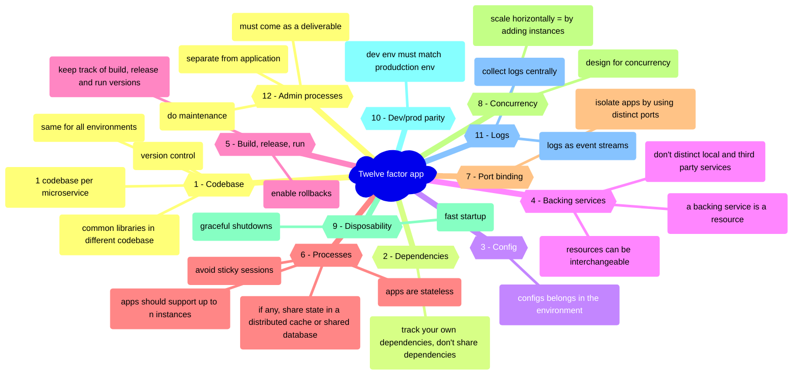

# The Twelve-Factor App

**What**: a set of principles and best practices for building modern, scalable, and maintainable software-as-a-service (SaaS) applications.

**Audience**: Developer that build applications which run as a service. Ops engineers that manage such applications.

## References
* https://12factor.net/
* https://learn.microsoft.com/en-us/dotnet/architecture/cloud-native/definition#the-twelve-factor-application
* https://www.redhat.com/architect/12-factor-app
* https://blog.sap-press.com/twelve-factor-app-principles-for-developers
* https://www.dreamfactory.com/resources/whitepapers/implementing-the-twelve-factor-app-methodology/

## Mindmap

